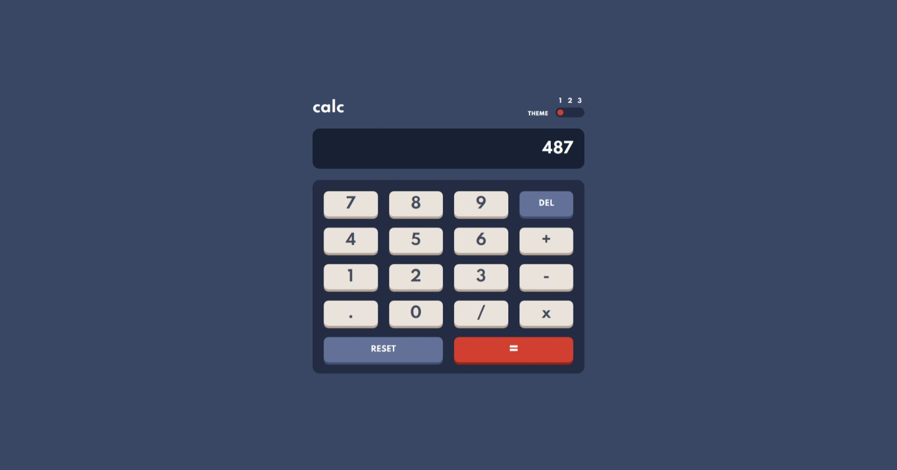
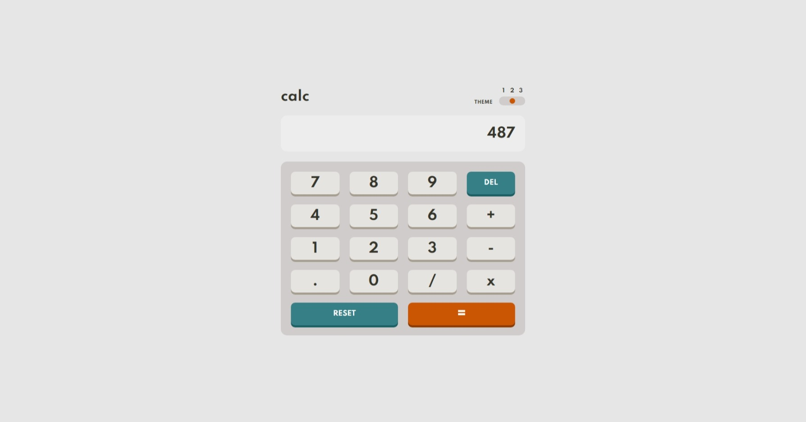
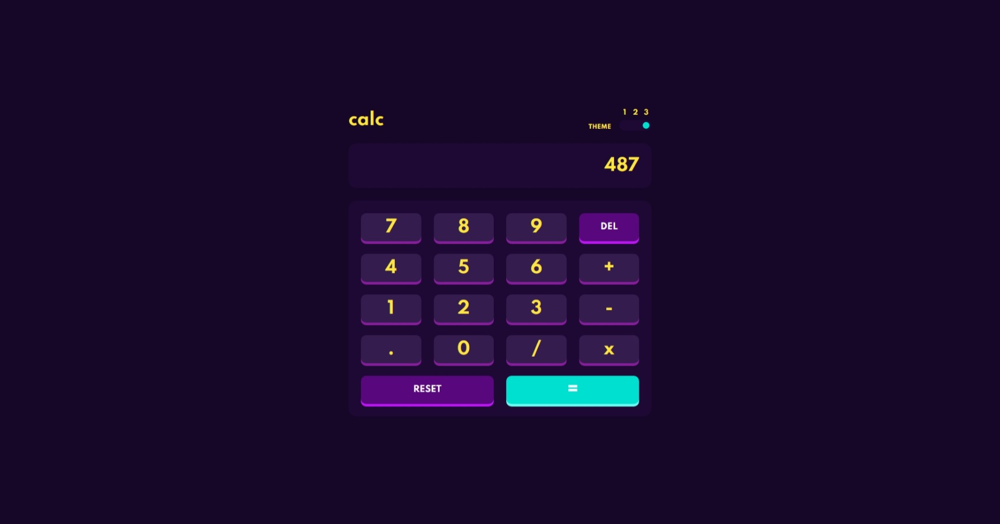

# Frontend Mentor - Calculator app solution

This is a solution to the [Calculator app challenge on Frontend Mentor](https://www.frontendmentor.io/challenges/calculator-app-9lteq5N29). Frontend Mentor challenges help you improve your coding skills by building realistic projects.

## Table of contents

- [Overview](#overview)
  - [The challenge](#the-challenge)
  - [Screenshot](#screenshot)
  - [Links](#links)
- [My process](#my-process)
  - [Built with](#built-with)
  - [What I learned](#what-i-learned)
  - [Continued development](#continued-development)
  - [Useful resources](#useful-resources)
- [Author](#author)
- [Acknowledgments](#acknowledgments)

**Note: Delete this note and update the table of contents based on what sections you keep.**

## Overview

### The challenge

Users should be able to:

- See the size of the elements adjust based on their device's screen size
- Perform mathmatical operations like addition, subtraction, multiplication, and division
- Adjust the color theme based on their preference
- **Bonus**: Have their initial theme preference checked using `prefers-color-scheme` and have any additional changes saved in the browser

### Screenshot





### Links

- Solution URL: [https://github.com/Dharmik48/fem-calculator](https://github.com/Dharmik48/fem-calculator)
- Live Site URL: [https://dharmik48.github.io/fem-calculator](https://dharmik48.github.io/fem-calculator)

## My process

### Built with

- Semantic HTML5 markup
- CSS custom properties
- Flexbox
- CSS Grid
- Mobile-first workflow
- ES6 Javascript

### What I learned

```html
<h1>Some HTML code I'm proud of</h1>
```

```css
.proud-of-this-css {
	color: papayawhip;
}
```

```js
const proudOfThisFunc = () => {
	console.log('🎉')
}
```

If you want more help with writing markdown, we'd recommend checking out [The Markdown Guide](https://www.markdownguide.org/) to learn more.

### Continued development

Use this section to outline areas that you want to continue focusing on in future projects. These could be concepts you're still not completely comfortable with or techniques you found useful that you want to refine and perfect.

### Useful resources

- [StackOverflow](https://stackoverflow.com/questions/18224064/dont-allow-typing-alphabetic-characters-in-a-input-type-number) - This post helped me fix a very irritating problem😩 of users able to type alphabets in the screen.
- [MDN Docs](https://developer.mozilla.org/en-US/docs/Web/JavaScript/Reference/Global_Objects/eval) - This page on the MDN docs was really helfull, making it easier😄 to implement the main purpose of a calculator with the eval() function.
- [A site from Wes Bos](https://keycode.info/) - Lastly this site from Wes Bos made it easier to find the keyCodes for the keys. Thanks @WesBos🤗.

## Author

- GitHub - [Dharmik48](https://github.com/Dharmik48)
- Frontend Mentor - [@Dharmik48](https://www.frontendmentor.io/profile/Dharmik48)
